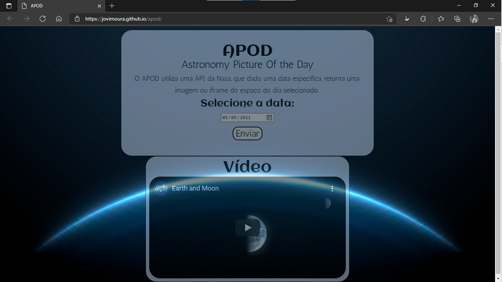
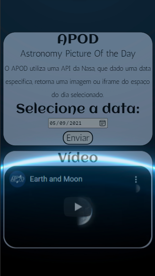

# APOD 🚀

## Astronomy Picture Of the Day 🚀🌙

O APOD utiliza uma API da Nasa, que dado uma data especifica, retorna uma imagem ou iframe do espaço do dia selecionado.

### Imagem do APOD 💻🚀

## Como foi feito? 🤔

Através do Java Script, criei um código que solicita uma imagem do dia selecionado, usando a API liberada pela NASA para o desenvolvimento do APOD.

Usei o Html para marcar cada divsisão da página e o alterei usando manipulação de DOM com Java Script e estilizei usando CSS.

É importante ressaltar que o APOD também possui um layout para navegadores de celulares e/ou tablets.

# Imagem do layout mobile 📱

## Tecnologias utilizadas 🦉

<ul>
    <li>HTML</li>
    <li>CSS</li>
    <li>Java Script</li>
</ul>

# Autor 😊

## João Victor dos Santos Moura

## Github: jovimoura

## Email: joaovictors.mouraa@gmail.com